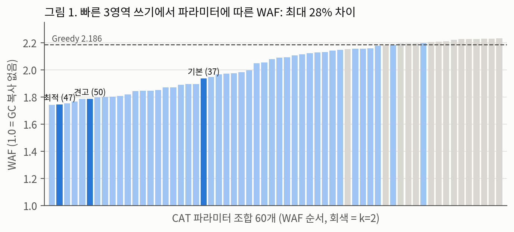
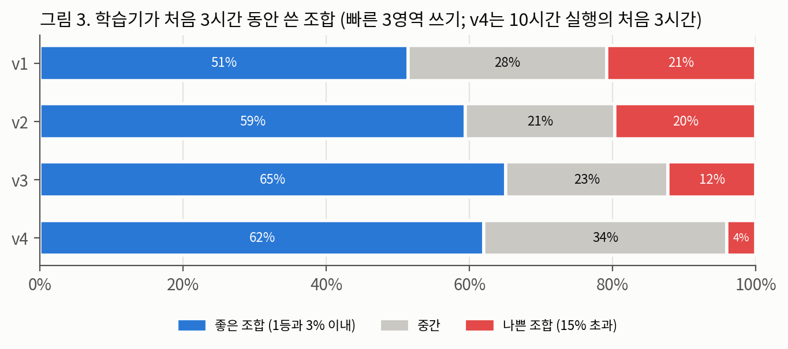
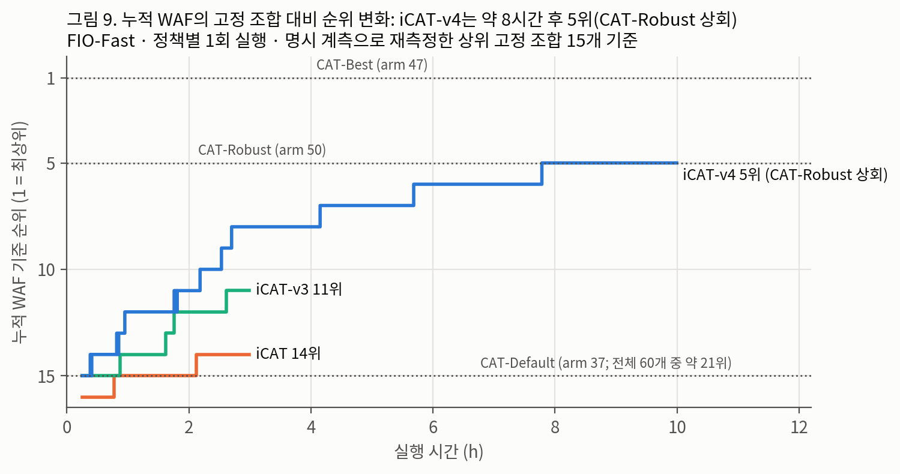
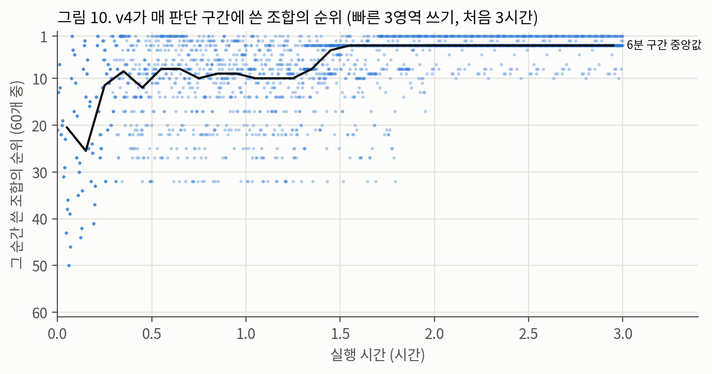
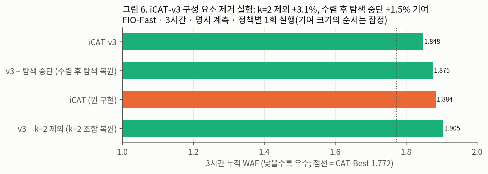
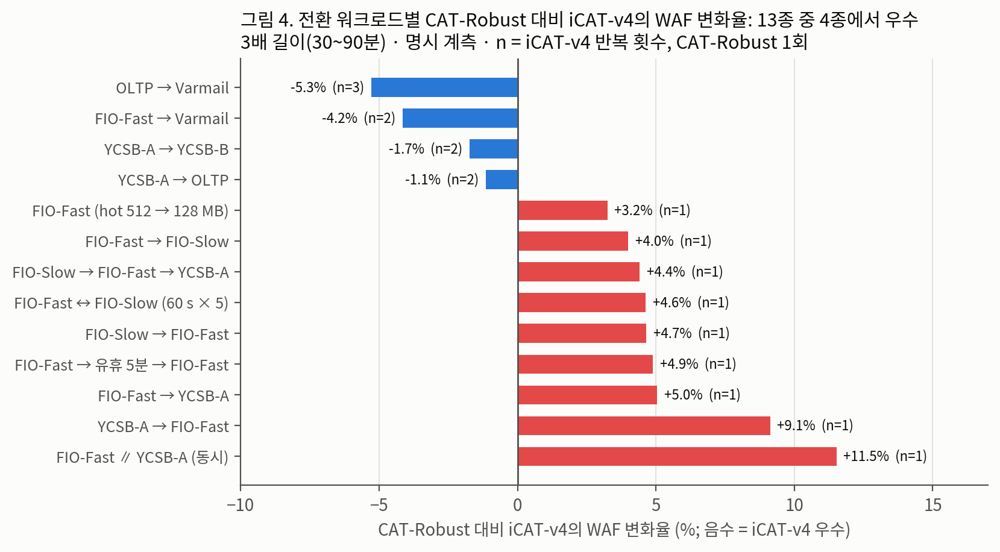
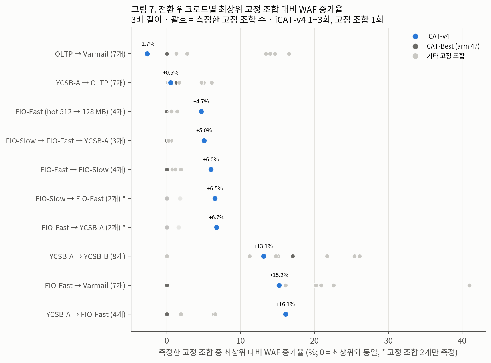
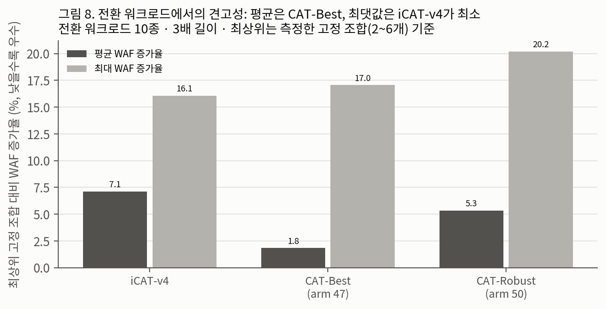
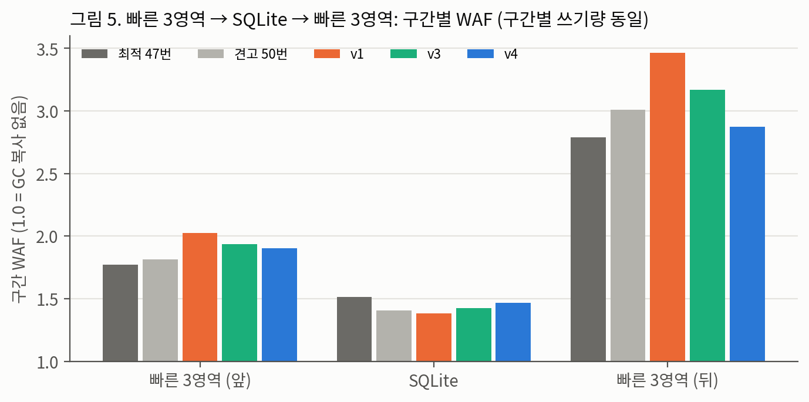

<!--
투고용 초안 v3 (2026-10-01). 처음 보는 리뷰어 심사(수정 후 재심) 반영본.
- 【결과 대기】: queue31(전환 워크로드 고정 조합 선별, 10/2) · queue32(iCAT-v4 n=3 반복, 구성 요소 제거, 10/4) 결과가 들어갈 자리.
- 【그림 N 자리】: 아직 만들지 않은 그림.
- 그림은 figs/ (python3 analysis/figures.py 로 원본에서 재생성). 그림 내부 제목은 검토용이며, 투고 시 제거하고 본문 캡션을 쓴다.
- 참고문헌 서지 정보는 투고 전 최종 확인. 부록 B는 투고본에서 삭제.
-->

# SSD 가비지 컬렉션 희생 블록 선택 파라미터의 온라인 학습: 재현 검증과 탐색 비용 중심의 개선

# Online Learning of Victim-Selection Parameters for SSD Garbage Collection: Reproduction and Exploration-Cost-Driven Improvement

저자1†, 저자2‡
(소속, 이메일)

---

## 요 약

SSD의 가비지 컬렉션(GC)은 희생 블록의 선택에 따라 쓰기 증폭(WAF)이 크게 달라진다. 블록 나이를 고려하는 CAT 정책은 세 파라미터의 조합에 따라 동일 워크로드에서도 WAF가 최대 약 28% 차이 나며, 최적 조합은 워크로드마다 다르다. 이 파라미터를 실행 중에 선택하도록 공개된 iCAT 구현은 60개 조합 중 하나를 discounted UCB로 고른다. 본 논문은 NVMeVirt 가상 SSD에서 iCAT을 재현하고 Greedy, 고정 파라미터 CAT과 비교하였다. iCAT은 기본 길이(10~30분) 실행에서 단일 워크로드와 전환 워크로드 전체에서 원저자 코드의 기본 파라미터보다 WAF가 높았다. 학습 기록을 분석한 결과, 초기 순회 이후에도 실행 시간의 13%를 저성능 조합에 사용하는 탐색 구조가 주된 원인이었으며, 판단 구간을 늘려 측정 변동을 줄이는 것만으로는 개선되지 않았다. 이에 모든 평가 워크로드에서 최하위였던 조합의 제외, 수렴 후 탐색 중단, 실행 중 후보 제거와 이웃 조합 탐색을 적용한 iCAT-v4를 설계하였다. iCAT-v4는 순회 이후 저성능 조합 사용을 1.6%로 낮추었고, 단일 워크로드 10시간 실행에서 같은 방식으로 재측정한 상위 고정 조합 15개 중 5위에 해당하는 WAF를 보였다. 전환 워크로드에서는 같은 길이로 비교한 기본 파라미터보다 모든 경우에 WAF가 낮았으나, 사전에 잘 선정한 고정 조합과는 워크로드에 따라 우열이 갈렸다. 단일 워크로드가 지속되는 경우 학습기가 그 워크로드의 최상위 고정 조합에 근접할 수는 있으나 넘기 어려운 이유를 논의한다.

**키워드**: SSD, 가비지 컬렉션, 쓰기 증폭, 온라인 학습, 멀티암드 밴딧, 재현 연구

## Abstract

Write amplification (WAF) of an SSD depends heavily on how garbage collection (GC) selects its victim block. The age-aware CAT policy varies WAF by up to about 28% on the same workload depending on three parameters, and the best setting differs across workloads. The publicly available iCAT implementation selects one of 60 settings at run time with a discounted UCB learner. We reproduce iCAT on the NVMeVirt virtual SSD and compare it with Greedy and fixed-parameter CAT. In base-length runs (10–30 minutes), iCAT showed higher WAF than the authors' default parameters on every steady and phase-changing workload. Log analysis shows that the main cause is an exploration structure that keeps spending 13% of the run on poor settings after the initial sweep; reducing measurement variance with a longer decision window alone did not help. We design iCAT-v4, which excludes the settings that were worst on every evaluated workload, stops exploration after convergence, eliminates candidates online, and probes only neighboring settings. After the initial sweep, iCAT-v4 spends 1.6% of the run on poor settings, and over a 10-hour steady run it reaches the WAF of the 5th of 15 top fixed settings re-measured with the same method. On phase-changing workloads it outperforms the default parameters in every same-length comparison, while against well-chosen fixed settings the outcome depends on the workload. We discuss why a learner can approach but hardly exceed the best fixed setting of a single steady workload.

**Keywords**: SSD, Garbage Collection, Write Amplification, Online Learning, Multi-armed Bandit, Reproducibility

---

## 1. 서론

플래시 메모리는 제자리 덮어쓰기가 불가능하므로 SSD는 갱신 데이터를 새 페이지에 기록하고 기존 페이지를 무효화한다. 가용 블록이 부족해지면 가비지 컬렉션(GC)이 희생 블록을 선택하여 유효 페이지를 다른 블록으로 복사한 뒤 해당 블록을 소거한다. 이 복사량이 쓰기 증폭(Write Amplification Factor, WAF)을 결정하며, WAF는 SSD의 성능과 수명에 직접 영향을 준다[1].

가장 단순한 희생 블록 선택 방식인 Greedy는 무효 페이지가 가장 많은 블록을 선택하므로, 곧 다시 무효화될 데이터를 복사하는 비효율이 생긴다. 블록 나이를 함께 고려하는 cost-benefit[2] 및 CAT(Cost-Age-Times)[3] 계열 정책은 오래 갱신되지 않은 블록을 우선 정리하여 이 비효율을 줄인다. 문제는 블록 나이를 등급화하는 파라미터가 워크로드에 따라 달라져야 한다는 점이다. 본 연구에서 사용한 CAT 구현은 세 파라미터의 조합 60개를 가지며, 동일 워크로드에서 조합에 따라 WAF가 최대 약 28% 달라졌다(3.3절).

iCAT[4]은 이 파라미터를 사전에 정하지 않고 SSD가 실행 중에 선택하도록 공개된 구현이다. 60개 조합을 멀티암드 밴딧 문제의 선택지로 보고, 판단 구간마다 한 조합을 적용한 뒤 그 구간의 WAF를 보상으로 하여 discounted UCB[5, 6]를 적용한다. 워크로드에 대한 사전 지식 없이 워크로드 변화에 적응한다는 것이 이 접근의 목표이다.

이 목표가 의미를 가지려면 두 조건이 필요하다. 첫째, 고정 파라미터가 워크로드 변화에서 실제로 손실을 겪어야 한다. 둘째, 학습기가 조합을 탐색하는 동안의 손실이 그보다 작아야 한다. 원 저장소에는 60개 조합의 실험 기록은 있으나 학습기 자체의 실행 결과는 없었다. 본 연구는 다음 질문에 답한다.

- **Q1.** 원 저장소의 실험 결과는 독립된 환경에서 재현되는가?
- **Q2.** iCAT은 사전에 선정한 고정 파라미터보다 WAF가 낮은가?
- **Q3.** 그렇지 않다면 원인은 무엇이며, 개선할 수 있는가?
- **Q4.** 온라인 학습이 고정 파라미터보다 우수할 수 있는 조건은 무엇인가?

본 논문의 기여는 다음과 같다.

1. iCAT을 가상 SSD에서 재현하고 단일 워크로드와 전환 워크로드 15종에서 고정 파라미터와 비교하였다. 모든 실행의 목적·조건·판정 기준과 결과, 실패한 실행과 철회한 주장을 공개 저장소의 실험 일지에 기록하였다.
2. iCAT이 고정 파라미터보다 열세인 주원인이 측정 변동보다 **초기 순회 이후에도 지속되는 탐색 비용**임을 학습 기록 분석과 구성 요소 제거 실험으로 보였다.
3. 탐색 비용을 줄인 iCAT-v3, iCAT-v4를 설계하여 순회 이후 저성능 조합 사용을 13.3%에서 1.6%로 낮추었다.
4. 단일 워크로드에서 학습기와 최상위 고정 조합 사이의 격차가 실행 시간에 따라 어떻게 줄어드는지, 그리고 비교 기준으로 쓰이는 "견고한" 고정 파라미터가 평가 워크로드에 따라 견고하지 않을 수 있음을 보였다.

## 2. 배경 및 관련 연구

### 2.1 GC와 쓰기 증폭

$$\mathrm{WAF} = \frac{P_{\text{host}} + P_{\text{GC}}}{P_{\text{host}}}$$

$P_{\text{host}}$는 호스트가 기록한 페이지 수, $P_{\text{GC}}$는 GC가 복사한 페이지 수이다. 1.0이 이상적이며 낮을수록 우수하다. 오버프로비저닝 영역이 작을수록 GC가 빈번해지고 희생 블록 선택의 영향이 커진다[1].

### 2.2 CAT 정책과 파라미터

CAT 계열 정책은 블록마다 $\text{score} = V / (I \times A)$를 계산하여 점수가 가장 낮은 블록을 선택한다. $V$는 유효 페이지 수, $I$는 무효 페이지 수, $A$는 블록 나이의 등급 가중치이다. 본 구현(원 저장소[4]의 CAT 구현)에서 블록 나이는 해당 블록에서 마지막 무효화가 발생한 이후의 경과 시간이며, 다음 세 파라미터로 등급화된다.

- $k \in \{2, 4, 7, 10\}$: 나이 등급 수. 등급 경계는 $k$별로 고정된 기준 임계값 목록(최대 360초)을 사용한다.
- $s \in \{25, 50, 100, 200, 400\}\%$: 기준 임계값에 곱하는 배율. 예를 들어 $k=10, s=25\%$의 경계는 1.7초~90초이다.
- $r \in \{4, 7, 16\}$: 최고 등급 가중치와 최저 등급 가중치의 비. 등급 $i$의 가중치는 최저 가중치에서 최고 가중치까지 선형으로 증가한다.

조합 번호(arm)는 0부터 시작하는 각 파라미터의 인덱스 $(k_i, s_i, r_i)$로 $15k_i + 3s_i + r_i$와 같이 부여한다. 예를 들어 arm 47은 $(k, s, r) = (10, 25\%, 16)$이다.

**WAF 증가율.** 워크로드 $w$에서 정책 $p$의 WAF 증가율은 $\Delta_w(p) = \mathrm{WAF}_w(p) / \mathrm{WAF}_w(\text{기준}) - 1$로 정의한다. 음수이면 정책 $p$가 기준보다 우수하다. 기준이 "최상위 고정 조합"일 때는 **그 워크로드에서 측정한 고정 조합 중 WAF가 가장 낮은 조합**을 뜻하며, 측정한 조합 수를 함께 밝힌다.

**표 1.** 비교 정책

| 이름 | 정의 |
|---|---|
| Greedy | 무효 페이지가 가장 많은 블록 선택 (나이 미고려) |
| CAT-Default | arm 37, $(7, 100\%, 7)$. 원 저장소 코드의 기본값 |
| CAT-Best | arm 47, $(10, 25\%, 16)$. 원 저장소의 60개 조합 기록에서 FIO-Fast의 최상위 조합. 본 환경의 측정에서는 2위(1위 arm 31과 0.1% 차이) |
| CAT-Robust | arm 50, $(10, 50\%, 16)$. 원 저장소 기록의 워크로드 6종(FIO-Slow, FIO-Fast, FIO-Shift, OLTP, YCSB-A, YCSB-B)에서 최상위 대비 WAF 증가율의 최댓값이 가장 작은 조합 |
| iCAT | 원 저장소의 학습기 구현[4] (2.3절) |
| iCAT-v2 | iCAT에서 판단 구간만 3배(GC 192회, 768 MiB)로 확대하고 강제 순회를 1회로 줄인 변형 |
| iCAT-v3, iCAT-v4 | 제안 기법 (5장). iCAT-v4는 iCAT-v3의 변경을 모두 포함한다 |

### 2.3 iCAT

iCAT[4]은 FTL 파티션마다 독립적으로 동작한다. **판단 구간**은 파티션에서 GC 64회와 호스트 쓰기 256 MiB가 **모두** 충족될 때 끝나며, FIO-Fast에서 약 10초이다. 판단 구간의 WAF를 보상으로 하며(낮을수록 좋음), 할인 계수 $\gamma = 0.9995$(반감기 약 1,376구간), 탐색 계수 $c = 0.25$(WAF 단위)의 discounted UCB로 다음 조합을 고른다. 60개 조합을 각 3회 강제 적용(FIO-Fast에서 약 30분)한 뒤, 최상위 조합이 12구간 동안 유지되고 3회 이상 확인되면 수렴으로 판정한다. 수렴 이후에도 8구간마다 가장 오래 적용하지 않은 조합을 1회 적용하고, 240구간이 지난 조합은 재확인하며, 판정된 조합의 WAF가 수렴 시점 대비 12.5% 이상 3구간 연속 변하면 학습 상태를 초기화한다.

### 2.4 관련 연구

UCB[5]와 비정상 환경을 위한 discounted UCB[6]는 탐색과 활용의 균형을 다룬다. 실행 중에 후보를 제거하는 successive elimination[7]은 탐색 비용을 줄이는 대표적 방법으로, 본 연구의 후보 제거는 이를 단순화한 고정 임계값 규칙이다. 【관련 연구 보강: SSD GC 정책의 학습 기반 선택, 핫·콜드 데이터 분리, 다중 스트림 연구를 투고 전에 추가. 원 iCAT의 학술 출판물이 있으면 [4]를 교체하고 "재현"의 대상을 명확히 함】

## 3. 실험 환경과 재현 검증

### 3.1 환경

NVMeVirt[8]로 8 GiB conventional SSD(FTL 파티션 4개, 오버프로비저닝 7%)를 구성하였다. 호스트는 Intel i7-7700, Linux 커널 7.0.0-31이며, 가상 SSD에 ext4를 nodiscard 옵션으로 마운트하였다. 원 저장소 소스는 대용량 연속 메모리 할당 두 곳만 kvmalloc/kvzalloc로 변경하였고 정책 코드는 수정하지 않았다.

WAF는 두 방식으로 측정하였다. **워밍업 제외 계측**(원 저장소 방식)은 파티션마다 처음 100회의 GC를 제외하고 모듈 해제 시점까지 집계한다. **구간 지정 계측**은 6 GiB 순차 쓰기와 3 GiB 무작위 쓰기로 장치를 사전 조건화한 뒤, 명시적인 시작·종료 신호 사이를 집계하며, 매 실행마다 FTL이 집계한 호스트 쓰기량이 블록 계층 통계와 일치하는지 검사한다. 동일 조합에서 두 방식은 1.5~3% 차이를 보였으므로(예: arm 47에서 1.746 대 1.774), **모든 비교는 동일 계측 방식의 값 사이에서만 수행하였다.** 60개 조합 전수 측정(3.3절)은 워밍업 제외 계측, 학습기와의 비교(6장)는 구간 지정 계측을 사용하였다.

### 3.2 워크로드

모든 fio 워크로드는 ext4 위의 6 GiB 파일(사용자 용량의 약 80%)에 direct I/O, libaio, 큐 깊이 32로 4 KB 무작위 쓰기를 수행한다. **핫 영역 갱신 주기**는 영역의 페이지 수를 그 영역의 초당 쓰기 수로 나눈 값이다.

**표 2.** 단일 워크로드

| 이름 | 구성 | 핫 영역 갱신 주기 |
|---|---|---|
| FIO-Fast | 512 MB / 1.5 GB / 4 GB 세 영역에 동시에 초당 24K / 12K / 4K회 쓰기. 기본 길이 10분 | 5.5초 |
| FIO-Slow | FIO-Fast와 같은 배치, 초당 쓰기 1/4, 같은 시간 | 22초 |
| FIO-Slow16 | 초당 쓰기 1/16, 20분 | 87초 |
| FIO-HotCold | 1 GB(초당 8K) + 5 GB(초당 2K) 두 영역, 10분 | 33초 |
| FIO-Shift | 앞 2 GB를 초당 32K·뒤 4 GB를 8K로 5분, 이후 두 영역의 속도를 맞바꾸어 5분 | 16초 |
| YCSB-A / YCSB-B | YCSB[10] + SQLite(WAL, 페이지 4 KB, synchronous=NORMAL), zipfian, 읽기:갱신 50:50 / 95:5. 레코드 1 KB, 단독 실행 400만 / 500만 레코드에 1,200만 / 600만 연산 | – |
| OLTP | Filebench[11] oltp: 512 MB 파일 10개, 쓰기 프로세스 10개(2 KB 무작위 쓰기 + dsync), 읽기 프로세스 200개, 5분 | – |
| Varmail | Filebench varmail: 평균 16 KB 파일 15만 개(단독) / 2.4만 개(전환), 스레드 16개의 생성·추가 쓰기·fsync·삭제 반복, 5분 | – |

전환 워크로드는 단일 워크로드를 순서대로 이어 실행하며(표기 A → B), 앞 단계의 파일과 데이터베이스는 삭제하지 않고 유지한다. 단계 사이에 재마운트나 사전 조건화는 없다. 단계 길이는 쓰기량으로 정한다(fio는 I/O 총량, YCSB는 연산 수). Filebench 단계만 시간으로 정한다. **$m$배 길이**는 모든 단계의 쓰기량(및 Filebench 실행 시간)을 $m$배로 한 것이다. 전환 워크로드 단계의 SQLite 데이터베이스는 6 GiB 파일과 공존하도록 60만 레코드(약 0.8 GiB)로 줄였고, OLTP는 파일 크기를 32~64 MB로 줄였다.

**표 3.** 전환 워크로드 (1배 길이 기준, 단계는 "단계 1 → 단계 2"로 표기)

| 이름 | 구성 | 1배 길이 | 측정한 길이 |
|---|---|---|---|
| FIO-Fast → YCSB-A | FIO-Fast 10분 분량 → YCSB-A(적재 + 400만 연산) | 약 16분 | 1, 3, 6배 |
| YCSB-A → FIO-Fast | 역순 | 약 25분 | 1, 3배 |
| FIO-Slow → FIO-Fast | FIO-Slow 10분 → FIO-Fast 10분 분량 | 20분 | 1, 3, 6배 |
| FIO-Fast → FIO-Slow | 역순 | 20분 | 1, 3, 6배 |
| FIO-Fast (hot 512 → 128 MB) | FIO-Fast → 핫 영역만 128 MB로 줄인 FIO-Fast(속도 동일) | 20분 | 1, 3, 6배 |
| FIO-Fast → Varmail | FIO-Fast 10분 분량 → Varmail 5분 | 약 15분 | 1, 3배 |
| OLTP → Varmail | OLTP(파일 64 MB) 5분 → Varmail 5분 | 10분 | 1, 3배 |
| YCSB-A → OLTP | YCSB-A(25만 레코드) → OLTP(파일 32 MB) 5분 | 약 10분 | 1, 3배 |
| YCSB-A → YCSB-B | 같은 데이터베이스에서 갱신 50% → 5% | 약 10분 | 1, 3배 |
| FIO-Slow → FIO-Fast → YCSB-A | 3단계 | 약 25분 | 1, 3배 |
| FIO-Fast ∥ YCSB-A | FIO-Fast(쓰기량 1/2)와 YCSB-A를 동시에 실행 | 약 12분 | 1, 3배 |
| FIO-Fast ↔ FIO-Slow (60 s × 5) | FIO-Fast 60초 분량과 FIO-Slow 60초를 5회 번갈아 실행 | 10분 | 1, 3배 |
| FIO-Fast → 유휴 → FIO-Fast | FIO-Fast 5분 분량 → I/O 없이 5분 → FIO-Fast 5분 분량 | 15분 | 1, 3배 |
| 점진적 부하 증가 | FIO-Slow 배치에서 초당 쓰기를 2분마다 10K → 50K로 증가 | 10분 | 1배 (단계 길이가 고정되어 길이 확장 불가) |
| 3단계 균등 전환 | FIO-Fast → YCSB-A → FIO-Fast, 단계별 호스트 쓰기량 동일(각 약 7,200만 페이지) | – | 3배 (약 2.3시간) |

전환 워크로드의 1배 길이 실행은 학습기의 초기 순회(iCAT 약 30분, iCAT-v3·v4 약 15분)보다 짧거나 비슷하므로, 학습기 평가는 3배 이상 길이에서 수행하였다. 3배 길이 비교 대상은 길이 확장이 불가한 점진적 부하 증가와 별도 설계한 3단계 균등 전환을 제외한 13종이다.

### 3.3 재현 검증과 파라미터 민감도 (Q1)

워밍업 제외 계측으로 측정한 Greedy의 WAF는 FIO-Fast에서 3회 평균 2.186으로 원 저장소 기록(2.223)과 1.7% 차이였다. 60개 조합의 순위는 원 저장소 기록과 Spearman 상관계수 0.959(FIO-Fast), 0.979(YCSB-A)로 일치하였다. OLTP는 0.164로 낮았는데, 같은 방식(5분, 1회)으로 상위 조합 4개를 3회 반복 측정한 결과 조합 간 평균 차이(1.6% 이내)가 같은 조합의 반복 간 차이(최대 8%)보다 작았다. OLTP에서는 파라미터의 영향이 짧은 실행의 측정 편차보다 작다.

**그림 1.** FIO-Fast에서 CAT 파라미터 조합 60개의 WAF (오름차순, 워밍업 제외 계측, 조합당 1회 10분). 연한 회색은 $k=2$ 조합, 진한 회색은 표 1의 비교 기준 조합이며 점선은 Greedy(3회 평균)이다.

그림 1과 같이 WAF는 조합에 따라 1.744(arm 31)에서 2.231까지 약 28% 차이 났다. 하위권은 $k=2$ 조합이 차지하였으며, 원 저장소 기록의 워크로드 6종 모두에서 최하위 조합은 $k=2$였고 Greedy와 0.4% 이내였다. 상위 조합은 파라미터 공간에서 인접하여 분포하였다($k$ 7~10, $s$ 25~50%). 핫 영역 갱신 주기가 87초인 FIO-Slow16에서는 측정한 21개 조합 중 상위 12개가 1% 이내에 분포하여, 갱신 주기가 길어지면 최적 조합이 다른 영역으로 이동한다는 사전 가설은 기각되었다.

## 4. iCAT의 분석 (Q2, Q3)

### 4.1 결과

1배 길이(10~30분)로 단일 워크로드 9종과 전환 워크로드 14종을 각 3회 실행한 결과, 모든 경우에 WAF 순서는 CAT-Best, CAT-Robust < CAT-Default < iCAT < Greedy였다(전체 결과는 부록 표 A1). FIO-Fast 10분 실행에서 iCAT의 WAF(2.001)는 같은 방식으로 재측정한 상위 고정 조합 15개(6.1절) 모두와 CAT-Default(1.974)보다 높았다. 실행이 길어지면 iCAT도 개선되어, FIO-Fast 3시간 실행(1.884)과 3단계 균등 전환(2.288)에서는 CAT-Default(1.974, 2.410)보다 낮아졌다. 그러나 CAT-Best와 CAT-Robust보다는 모든 길이에서 높았다.

### 4.2 원인: 측정 변동보다 탐색 비용

동일 조합을 판단 구간 단위로 반복 측정한 WAF의 범위는 0.385로, 조합 간 실제 차이(0.098)보다 컸다. 이 변동이 직전 구간에 적용된 조합의 영향인지 확인하기 위해, 같은 조합의 구간 WAF를 직전 구간이 같은 조합인 경우와 다른 조합인 경우로 나누었다. 표준편차는 각각 0.120과 0.139로, 변동의 대부분은 직전 조합과 무관한 구간 자체의 변동이었다. 판단 구간을 3배로 늘려 변동을 줄인 iCAT-v2는 FIO-Fast 3시간 실행에서 iCAT과 차이가 없었다(1.878~1.902 대 1.884).

**그림 2.** FIO-Fast 초기 3시간 동안 학습기가 적용한 조합의 분포 (구간 지정 계측, 정책별 1회 실행). 조합 등급은 그림 1의 값으로 정하며, **상위 조합**은 그림 1의 최상위(1.744) 대비 WAF 3% 이내, **저성능 조합**은 15% 초과, 그 사이를 **중위 조합**으로 한다.

**표 4.** 저성능 조합 사용 비율의 분해 (FIO-Fast, 초기 3시간)

| 정책 | 전체 | 초기 순회 중 (시간 비중) | 순회 이후 (전체 대비) |
|---|---:|---:|---:|
| iCAT | 20.9% | 55.0% (14%) | 15.4% (13.3%p) |
| iCAT-v2 | 19.7% | 55.0% (12%) | 14.9% (13.1%p) |
| iCAT-v3 | 12.3% | 40.0% (6%) | 10.5% (9.9%p) |
| iCAT-v4 | 4.0% | 40.0% (6%) | 1.7% (1.6%p) |

iCAT이 사용한 저성능 조합 20.9% 중 7.6%p는 초기 강제 순회에서, 13.3%p는 순회 이후에 발생하였다. 순회 이후의 사용은 세 요인에서 비롯된다. (1) 수렴 이후에도 8구간마다 가장 오래 적용하지 않은 조합을 적용하는데, 이러한 조합은 대부분 저성능 조합이다. (2) 할인 계수로 과거 보상이 감쇠하여 저성능 조합이 다시 탐색 대상이 된다. (3) 초기화 임계값 12.5%는 구간 변동만으로도 초과될 수 있다.

## 5. 제안 기법

### 5.1 iCAT-v3

iCAT-v3는 iCAT에 다음 네 가지를 변경한다.

1. 원 저장소 기록과 본 환경 측정 모두에서 최하위였던 $k=2$ 조합 15개를 후보에서 제외한다(45개). 이 규칙은 평가 워크로드에서 얻은 사전 정보이며, 5.3절의 실행 중 제거와 구분한다.
2. 강제 순회를 1회로 줄이고 판단 구간을 2배(GC 128회, 512 MiB)로 확대한다(FIO-Fast에서 순회 약 15분).
3. 수렴 이후의 주기적 탐색을 중단한다.
4. 초기화 임계값을 25%로 상향한다.

### 5.2 iCAT-v4

iCAT-v4는 iCAT-v3의 변경을 모두 포함하고 다음을 추가한다.

1. **실행 중 후보 제거.** 모든 후보를 1회 이상 적용한 이후, 할인 평균 WAF가 현재 최상위 조합보다 15% 이상 높은 조합을 후보에서 제거한다. 실행 중 측정값만 사용한다.
2. **이웃 탐색.** 수렴 이후 8구간마다 최상위 조합의 이웃 조합(세 파라미터 중 하나만 한 단계 다른 조합, 파라미터 공간의 경계에서는 6개 미만)을 순서대로 1회씩 적용하며, 적용한 이웃은 후보로 복원한다. 상위 조합이 파라미터 공간에서 인접한다는 3.3절의 관찰에 근거한다.
3. **부분 초기화.** 학습 상태를 초기화할 때 45개 전체가 아니라 잔존 후보와 그 이웃만 복원한다.

수렴 판정 기준(12구간 유지, 3회 확인)은 iCAT과 같다.

【그림 3 자리: iCAT-v4 동작 개요. 배경은 $k \times s$ 격자($r$은 색), ① 45개 순회 → ② 실행 중 제거(예: 45 → 21 → 3개) → ③ 수렴 후 이웃 탐색(최상위 arm 47과 이웃 arm 32·46·50) → ④ 초기화 시 잔존 후보와 이웃만 복원】

## 6. 실험 결과

모든 결과는 구간 지정 계측 값이다.

### 6.1 단일 워크로드

**표 5.** FIO-Fast에서 실행 시간별 누적 WAF (정책별 1회 실행; iCAT-v2 3시간은 2회 평균; iCAT-v4의 1·3시간 값은 10시간 실행의 해당 시점 누적값)

| 실행 시간 | CAT-Best | CAT-Robust | CAT-Default | iCAT | iCAT-v2 | iCAT-v3 | iCAT-v4 |
|---|---:|---:|---:|---:|---:|---:|---:|
| 10분 | 1.774 | – | 1.974 | 2.001 | (순회 중 종료) | 1.963 | – |
| 30분 | 1.760 | – | – | 2.002 | 2.004 | 1.939 | – |
| 1시간 | 1.773 | 1.812 | – | 1.964 | 1.958 | 1.903 | 1.871 |
| 3시간 | 1.772 | 1.814 | – | 1.884 | 1.890 | 1.848 | 1.829 |
| 10시간 | – | – | – | – | – | – | 1.807 |

고정 조합의 WAF는 실행 시간과 거의 무관하였다(arm 47: 10분 1.774, 3시간 1.772). "–"는 해당 길이로 측정하지 않은 칸이다.

**그림 4.** FIO-Fast에서 학습기의 누적 WAF를 고정 조합 대비 순위로 나타낸 변화 (정책별 1회 실행). 순위 기준은 그림 1의 상위 14개 조합과 CAT-Default를 구간 지정 계측으로 재측정한 15개이다. CAT-Default는 이 15개 중 15위이며 60개 전체에서는 약 21위이다.

모든 시점에서 iCAT-v4 < iCAT-v3 < iCAT 순이었다. 누적 WAF가 실행이 길어질수록 낮아지는 것은 초기 순회 비용이 긴 실행에 분산되기 때문이다. iCAT-v4의 구간 WAF(해당 시간 구간만의 WAF)는 3시간 이후 약 1.80에서 안정되었다. 재측정한 15개와 비교하면 iCAT-v4의 10시간 누적 WAF(1.807)는 5위로 CAT-Robust(1.812, 6위)보다 낮았으나 차이는 0.3%였다. 같은 3시간 시점에서는 iCAT-v4가 8위, iCAT-v3가 11위, iCAT이 14위였다.

**그림 5.** iCAT-v4가 판단 구간마다 적용한 조합의 순위 (FIO-Fast, 초기 3시간, 1회 실행; 순위는 그림 1 기준). 점은 판단 구간 하나, 선은 6분 구간의 중앙값이다. 약 1.5시간 이후 상위 3위 이내 조합(arm 31, 47, 46)을 주로 적용하며, 간헐적인 10위 부근 적용은 이웃 탐색이다. 순회(약 15분) 이후 1.5시간까지 20~30위 조합을 적용한 것은 후보 제거 이전의 UCB 탐색이다.

**구성 요소 제거.** iCAT-v3의 변경 중 두 가지를 하나씩 되돌린 결과(그림 6), $k=2$ 조합을 복원하면 3시간 WAF가 1.848에서 1.905로(+3.1%), 수렴 후 탐색을 복원하면 1.875로(+1.5%) 높아졌다. $k=2$만 복원한 경우가 iCAT(1.884)보다도 높은 것은, iCAT-v3의 다른 변경(1회 순회)이 $k=2$ 조합까지 포함한 상태에서는 오히려 불리할 수 있음을 시사한다. 두 효과의 합(4.6%)이 iCAT 대비 iCAT-v3의 개선(1.9%)보다 커서 요소 간 상호작용이 있다. 각 1회 실행이므로 크기는 잠정적이며, 나머지 변경(판단 구간, 순회 횟수, 초기화 임계값)과 iCAT-v4의 세 메커니즘에 대한 제거 실험을 진행 중이다【결과 대기】.

**그림 6.** iCAT-v3 구성 요소 제거 실험 (FIO-Fast, 3시간 누적 WAF, 정책별 1회 실행). 막대 이름의 "v3 − X"는 iCAT-v3에서 변경 X를 되돌린 것이다. 점선은 CAT-Best이다.

### 6.2 전환 워크로드

**CAT-Default, CAT-Robust와의 비교.** 3배 길이 전환 워크로드 13종에서 iCAT-v4를 CAT-Robust와 비교하였다(그림 7). iCAT-v4는 4종에서 1.1~5.3% 낮은 WAF를 보였고, 9종에서 3.2~11.5% 높았다. 우수한 4종에는 CAT-Robust가 부적합한 단계(Varmail에서 arm 50은 측정한 상위 조합보다 16% 높음)가 포함되었고, 열세인 9종은 CAT-Robust가 상위권인 fio 단계와 YCSB-A 단계로 구성되었다. CAT-Default를 같은 길이로 측정한 5종(3단계 균등 전환 포함)에서는 iCAT-v4가 모두 낮았다(4.3~18.3%). **현재 iCAT-v4는 우수했던 4종만 2~3회, 나머지 9종은 1회 실행하였다.** 모든 전환 워크로드를 3회로 맞춘 결과로 그림 7을 갱신할 예정이다【결과 대기】.

**그림 7.** 3배 길이 전환 워크로드 13종에서 CAT-Robust 대비 iCAT-v4의 WAF 증가율 (음수가 iCAT-v4 우수, n은 iCAT-v4 반복 횟수; CAT-Robust 1회).

**상위 고정 조합과의 비교.** iCAT-v4가 CAT-Robust보다 우수했던 4종에서 고정 조합 6개(arm 47, 46, 31, 17, 37, 50)를 같은 길이로 측정하였다(표 6).

**표 6.** 전환 워크로드 4종에서 iCAT-v4와 고정 조합 6개의 WAF (3배 길이; iCAT-v4는 2~3회 평균, 고정 조합 1회)

| 전환 워크로드 | iCAT-v4 (n) | arm 47 (Best) | arm 17 | arm 50 (Robust) | arm 46 | arm 31 | arm 37 (Default) | iCAT-v4 순위 |
|---|---:|---:|---:|---:|---:|---:|---:|---|
| OLTP → Varmail | **1.859** (3) | 1.910 | 1.935 | 1.963 | 2.167 | 2.177 | 2.226 | 1/7 |
| FIO-Fast → Varmail | 2.352 (2) | **2.042** | 2.503 | 2.454 | 2.367 | 2.468 | 2.879 | 2/7 |
| YCSB-A → YCSB-B | 1.366 (2) | 1.414 | **1.208** | 1.390 | 1.515 | 1.524 | 1.470 | 2/7 |
| YCSB-A → OLTP | 1.127 (2) | 1.136 | **1.123** | 1.140 | 1.174 | 1.190 | 1.178 | 2/7 |

iCAT-v4는 4종 모두에서 1~2위였으며, OLTP → Varmail에서는 측정한 고정 조합 6개보다 모두 낮았다(arm 47 대비 −2.7%). 그러나 이 차이는 iCAT-v4의 반복 간 차이(약 2%)와 비슷하고 고정 조합은 1회 측정이므로, 고정 조합 반복 측정 결과가 나오기 전에는 "동등 이상"으로 해석한다【결과 대기: arm 47·17·50 각 3회】. 나머지 3종에서는 전 단계에 적합한 단일 조합(arm 47 또는 arm 17)이 존재하였고, FIO-Fast → Varmail에서 iCAT-v4는 arm 47보다 15.2% 높았다.

**그림 8.** 전환 워크로드별, 측정한 고정 조합 중 최상위 대비 WAF 증가율 (3배 길이; 괄호는 측정한 고정 조합 수, *는 2개만 측정). 【선별 실험 결과로 갱신 예정】

**견고성.** iCAT-v4, CAT-Best, CAT-Robust를 모두 같은 길이로 측정한 전환 워크로드 6종에서 측정 고정 조합 중 최상위 대비 WAF 증가율의 평균은 CAT-Best 3.0%, iCAT-v4 6.5%, CAT-Robust 7.2%였고, 최댓값은 iCAT-v4 15.2%(FIO-Fast → Varmail), CAT-Best 17.0%(YCSB-A → YCSB-B), CAT-Robust 20.2%였다(그림 9). 원 저장소 워크로드로 선정된 CAT-Robust는 전환 워크로드에서 견고하지 않았다. iCAT-v4의 최댓값이 CAT-Best보다 작으나, 차이(1.8%p)가 작고 기준 조합 수가 워크로드마다 2~6개로 달라 견고성의 우위를 주장하기에는 근거가 부족하다.

**그림 9.** 전환 워크로드 6종에서 정책별 최상위 고정 조합 대비 WAF 증가율의 평균과 최댓값 (3배 길이).

【결과 대기 · 표 7 자리: 전환 워크로드 11종에서 고정 조합 16개를 1배 길이로 선별한 뒤 상위 3개를 3배 길이로 확인한 결과. 워크로드별 최상위 고정 조합, 전체에서 평균·최대 WAF 증가율이 가장 작은 고정 조합, iCAT-v4(n=3)의 평균·최대 WAF 증가율.】

**3단계 균등 전환.** 단계별 최상위 조합이 다른 워크로드에서 학습기의 적응을 보기 위해 FIO-Fast → YCSB-A → FIO-Fast를 단계별 호스트 쓰기량이 같도록 구성하였다.

**표 8.** 3단계 균등 전환의 단계별 WAF (CAT-Robust, iCAT-v4는 2회 평균, 그 외 1회)

| 정책 | FIO-Fast (단계 1) | YCSB-A (단계 2) | FIO-Fast (단계 3) | 전체 |
|---|---:|---:|---:|---:|
| CAT-Best | 1.773 | 1.512 | 2.788 | 2.024 |
| CAT-Robust | 1.814 | 1.405 | 3.009 | 2.074 |
| iCAT-v4 | 1.901 | 1.468 | 2.872 | 2.079 |
| arm 17 (단계 2 최상위) | 1.872 | 1.371 | 3.293 | 2.176 |
| iCAT-v3 | 1.935 | 1.425 | 3.168 | 2.177 |
| iCAT | 2.026 | 1.382 | 3.463 | 2.288 |
| CAT-Default | 1.977 | 1.499 | 3.760 | 2.410 |
| 단계별 측정 최상위의 합성 | 1.773 | 1.371 | 2.788 | 1.977 |

단계별 호스트 쓰기량이 같으므로 전체 WAF는 단계 WAF의 평균과 같다. 마지막 행은 각 단계에서 측정한 정책 중 최저값을 골라 평균한 값으로, 측정한 정책 범위 안에서 단계마다 최적 조합을 바꿔 쓸 수 있을 때의 하한 추정이다.

**그림 10.** 3단계 균등 전환의 단계별 WAF (구간 지정 계측, 3배 길이 약 2.3시간).

학습기는 모두 단계 2(YCSB-A)에서 CAT-Best보다 낮은 WAF를 보였다. 차이는 FIO-Fast로 복귀하는 단계 3에서 발생하였다. iCAT-v3는 초기화 후 45개 조합을 재순회하여 단계 3의 16%를 저성능 조합에 사용하였으나, iCAT-v4는 잔존 후보 3개(arm 47, 32, 46)와 그 이웃만 복원하여 arm 47로 복귀하였다(1회차 기준 저성능 조합 0%, 단계 3 WAF 2.844; 2회 평균 2.872). 다만 단계별 최적화로 얻을 수 있는 여지가 2.4%(1.977 대 2.024)로 작고 iCAT-v4의 반복 간 차이가 약 2%여서, 전체 WAF는 CAT-Robust와 비슷하고 CAT-Best보다 2.7% 높았다. 단계 3의 WAF가 모든 정책에서 단계 1보다 높은 것은 단계 2의 데이터베이스가 가용 공간을 점유한 영향으로 추정되나 확인하지 않았다.

## 7. 논의

**학습기와 최상위 고정 조합의 격차 (Q4).** 상태가 없는 밴딧 모형에서는 처음부터 최적 조합만 쓰는 정책이 탐색이 필요한 학습기보다 누적 보상이 높다. GC는 블록 배치라는 상태를 가지므로 이 논리가 엄밀히 성립하지는 않으나, 4.2절에서 직전 조합의 영향이 작게 나타났고 단일 워크로드의 모든 실험에서 학습기는 최상위 고정 조합에 근접할 뿐 넘지 못하였다(FIO-Fast 10시간에서 +2.0%). 따라서 학습기가 이득을 낼 수 있는 경우는 (1) 워크로드를 모르는 상태에서 고른 고정 조합이 그 워크로드에 부적합한 경우, (2) 단계마다 최상위 조합이 달라 어떤 단일 조합도 모든 단계에 적합하지 않은 경우이다. iCAT-v4는 (1)의 예로 Varmail이 포함된 전환 워크로드에서 CAT-Robust보다 낮은 WAF를 보였고, (2)의 예로 OLTP → Varmail에서 측정한 고정 조합보다 낮은 WAF를 보였다(반복 확인 진행 중).

**개선의 핵심.** 측정 변동을 줄인 iCAT-v2는 효과가 없었고, 저성능 조합 사용을 줄인 iCAT-v3와 iCAT-v4가 효과적이었다(표 4). 이웃 탐색과 부분 초기화는 워크로드가 전환되었다가 복귀하는 경우에 특히 효과적이었다(6.2절).

**사전 정보의 범위.** iCAT-v3의 $k=2$ 제외는 평가 워크로드에서 얻은 사전 정보이며 개선 기여가 가장 컸다(그림 6). 따라서 "사전 지식이 필요 없다"는 성질은 iCAT-v4의 실행 중 제거와 이웃 탐색에만 해당한다.

**비교 기준의 편향.** CAT-Best와 CAT-Robust는 평가 워크로드를 참고하여 선정한 조합이므로 학습기에 불리한 비교이다. 원 저장소 워크로드로 선정된 CAT-Robust는 Varmail에서 측정 최상위보다 16% 높았다. 반면 CAT-Best(arm 47)는 FIO-Fast, YCSB-A, Varmail에서 모두 상위였다. 본 환경의 워크로드 대부분에서 단일 고정 조합이 넓은 범위에서 우수하였고, 이것이 학습기의 개선 여지를 제한하였다.

## 8. 한계

1. 학습기 결과의 반복 횟수가 1~3회이다. iCAT-v4의 반복 간 차이는 약 2%였다. 고정 조합은 구간 지정 계측에서 반복 간 차이가 0.1% 이내였으나(3단계 균등 전환 arm 50: 2.074, 2.073), 워밍업 제외 계측의 5분 OLTP 실행에서는 최대 8%였다.
2. iCAT-v3와 iCAT-v4는 FIO-Fast와 3단계 균등 전환의 결과를 참고하여 설계하였다. 단일 워크로드에서 iCAT-v3·v4를 평가한 것은 FIO-Fast뿐이다.
3. 전환 워크로드의 고정 조합 비교는 일부 조합(2~6개)에 한정된다.
4. iCAT-v4의 실행 중 제거는 고정 임계값(15%)을 사용하며, 판단 구간 변동(표준편차 약 0.12, WAF 1.8의 약 7%)을 고려하면 상위 조합이 잘못 제거될 수 있다. 잘못 제거된 빈도는 측정하지 않았다.
5. 단일 가상 SSD(8 GiB, 오버프로비저닝 7%)에서만 실험하였다. 실제 SSD, 다른 오버프로비저닝 비율, 실제 서버 트레이스는 다루지 않았다.
6. 실험 기간 중 두 차례, 메모리에 캐시된 실행 파일이 손상되어 일부 실행이 시작 직후 실패하였다. 해당 실행은 재수행하였다. 정상 종료한 실행은 호스트 쓰기량이 블록 계층 통계와 일치함을 확인하였으나, 원인(가상 SSD의 메모리 접근 또는 하드웨어 결함)은 확인하지 못하였다.

## 9. 결론

본 논문은 SSD GC 파라미터를 실행 중에 선택하는 iCAT 구현을 재현하여, 기본 길이 실행에서 원 저장소의 기본 파라미터보다도 WAF가 높았으며 그 주원인이 초기 순회 이후에도 지속되는 탐색 비용임을 보였다. 최하위 조합의 제외, 수렴 후 탐색 중단, 실행 중 후보 제거와 이웃 탐색을 적용한 iCAT-v4는 순회 이후 저성능 조합 사용을 13.3%에서 1.6%로 낮추었고, 단일 워크로드 장시간 실행에서 재측정한 상위 고정 조합 15개 중 5위 수준에 이르렀다. 전환 워크로드에서는 같은 길이의 기본 파라미터보다 모두 낮은 WAF를 보였으나, 사전에 잘 선정한 고정 조합과는 워크로드에 따라 우열이 갈렸다. 향후 반복 실험과 구성 요소 제거 실험의 완료, 초기 순회를 대신하는 이웃 기반 탐색, 다수 장비를 이용한 전체 조합 비교, 실제 서버 트레이스와 실제 SSD에서의 검증을 수행한다.

## 참고문헌

<!-- 투고 전 서지 정보(권·호·쪽) 최종 확인 필요 -->

[1] X.-Y. Hu, E. Eleftheriou, R. Haas, I. Iliadis, R. Pletka, "Write Amplification Analysis in Flash-Based Solid State Drives," *Proc. SYSTOR*, 2009.

[2] M. Rosenblum, J. K. Ousterhout, "The Design and Implementation of a Log-Structured File System," *ACM Transactions on Computer Systems*, vol. 10, no. 1, 1992.

[3] M.-L. Chiang, P. C. H. Lee, R.-C. Chang, "Using Data Clustering to Improve Cleaning Performance for Flash Memory," *Software: Practice and Experience*, vol. 29, no. 3, 1999.

[4] iCAT 저장소, https://github.com/meendragon/iCAT (commit 7236149). 【원 논문·보고서가 있으면 교체】

[5] P. Auer, N. Cesa-Bianchi, P. Fischer, "Finite-time Analysis of the Multiarmed Bandit Problem," *Machine Learning*, vol. 47, 2002.

[6] A. Garivier, E. Moulines, "On Upper-Confidence Bound Policies for Switching Bandit Problems," *Proc. ALT*, 2011.

[7] E. Even-Dar, S. Mannor, Y. Mansour, "Action Elimination and Stopping Conditions for the Multi-Armed Bandit and Reinforcement Learning Problems," *Journal of Machine Learning Research*, vol. 7, 2006.

[8] S.-H. Kim, J. Shim, E. Lee, S. Jeong, I. Kang, J.-S. Kim, "NVMeVirt: A Versatile Software-defined Virtual NVMe Device," *Proc. USENIX FAST*, 2023.

[9] J. Axboe, "fio: Flexible I/O Tester," https://github.com/axboe/fio.

[10] B. F. Cooper, A. Silberstein, E. Tam, R. Ramakrishnan, R. Sears, "Benchmarking Cloud Serving Systems with YCSB," *Proc. ACM SoCC*, 2010.

[11] V. Tarasov, E. Zadok, S. Shepler, "Filebench: A Flexible Framework for File System Benchmarking," *;login:*, vol. 41, no. 1, 2016.

---

### 부록 A. 재현성

실행 스크립트, 모듈 해시, 원본 로그, 실행 전 기록과 결과는 공개 저장소에 있다. 표와 그림은 원본 결과에서 스크립트로 재생성할 수 있다. 【익명 심사 규정에 맞게 저장소 위치 표기 조정】

**표 A1.** 1배 길이 결과 요약 (각 3회 평균) 【RESULTS_ALL.md 4장 표를 옮겨 실음】

### 부록 B. 그림 번호 대응 (투고본에서 삭제)

| 본문 | 파일 | 상태 |
|---|---|---|
| 그림 1 | figs/fig1_sensitivity | 완성 |
| 그림 2 | figs/fig3_time_use | 완성 |
| 그림 3 | (iCAT-v4 동작 개요) | **작성 필요** |
| 그림 4 | figs/fig9_rank_over_time | 완성 |
| 그림 5 | figs/fig10_v4_choices | 완성 |
| 그림 6 | figs/fig6_ablation | queue32 결과로 확장 |
| 그림 7 | figs/fig4_mixes_v4_vs_robust | queue32 결과(n=3)로 갱신 |
| 그림 8 | figs/fig7_mix_loss_by_workload | queue31 결과로 갱신 |
| 그림 9 | figs/fig8_robustness | queue31 결과로 갱신 |
| 그림 10 | figs/fig5_three_phase_mix | 완성 |
