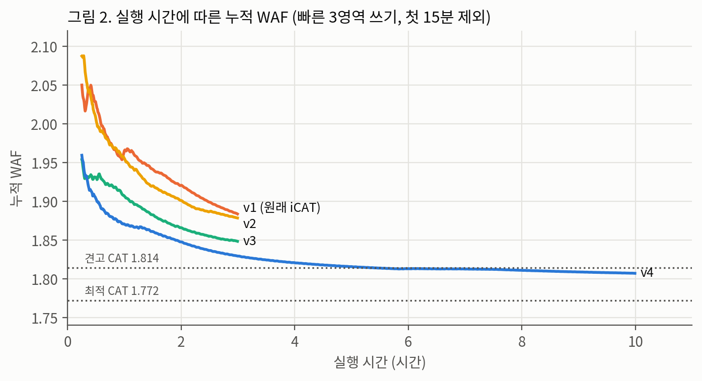

# iCAT 실험 저장소

SSD의 GC(쓰레기 수거)가 어떤 블록을 지울지 고르는 정책 **CAT**의 파라미터를, 실행 중에 스스로 고르는 온라인 학습기 **iCAT**을 검증하고 고친 실험 기록이다. 원저자 코드와 사전 결과: https://github.com/meendragon/iCAT (commit 7236149).

- 가상 SSD(NVMeVirt) 8 GiB, 여유 공간 7%, 한 컴퓨터(i7-7700)에서 2026-09-06 ~ 09-30 실행.
- 모든 실행은 **실행 전에 목적·조건·판정 기준을 적고**(사전 등록) 결과를 그 아래 적었다. 실패와 철회한 주장도 지우지 않았다 → `EXPERIMENT_LOG.md`
- WAF = SSD가 실제로 쓴 양 ÷ 내가 쓴 양. **1.0이 이상적, 낮을수록 좋다.**

> 기준 2026-09-30. 추가 실험(전환 워크로드 11종에서 고정 후보 16개를 짧게 거르고 상위 3개를 길게 확인)이 10/2까지 진행 중이며, 끝나면 결과표와 그림이 자동 갱신된다. 투고용 논문 초안은 `PAPER_KCI_DRAFT.md`.

---

## 한눈에 보는 결론

1. **측정은 믿을 수 있다.** 원저자 결과를 0.9% 차이로 재현했고, 60개 조합 순위도 일치했다(ρ 0.96~0.98).
2. **원래 iCAT(v1)은 모든 경우에 원저자 기본 파라미터보다도 나빴다.** 단일 워크로드 9종, 전환 워크로드 14종 × 3회 전부.
3. **원인은 잡음보다 탐색 구조였다.** 좋은 조합을 찾은 뒤에도 시간의 21%를 나쁜 조합에 썼다. 측정 구간을 늘린 v2는 효과가 없었고, 나쁜 조합을 빼고 탐색을 줄인 v3와 후보를 기억하는 v4가 효과를 냈다.
4. **v4는 기본 파라미터보다 거의 항상 좋다**(최대 16.5%). 여러 워크로드에서 무난하도록 미리 고른 **견고 파라미터와는 워크로드에 따라 갈린다**: 견고 파라미터가 일부 구간에 안 맞는 전환 워크로드 4종에서는 v4가 1~6% 좋았고(2회 반복 확인), 잘 맞는 워크로드에서는 2~11% 나빴다.
5. **거래 DB → 메일 서버 전환에서는 v4가 상위 고정 조합 6개를 모두 이겼다**(최고 대비 −2.7%, v4 3회 평균). 나머지 3종에서도 v4는 7개 중 2위였다.
6. **워크로드 하나만 계속 도는 경우 최적 고정 파라미터는 원리상 넘을 수 없다.** v4는 10시간 실행에서 최적과 +2.0%까지 좁혔고, 같은 측정 방식으로 매긴 순위는 60개 고정 조합 중 5위였다.

## 그림

| | |
|---|---|
|  파라미터에 따라 WAF가 최대 28% 달라진다 |  버전이 오를수록, 오래 돌릴수록 좋아진다 |
|  나쁜 조합에 쓰는 시간: 21% → 12% → 4% |  전환 워크로드 13종: v4 대 견고 파라미터 |
|  구간이 바뀔 때 v4는 빨리 복귀한다 |  v3의 두 변경은 각각 3.1%, 1.5% 기여 |
|  전환 워크로드별 1등 고정 조합 대비 손해 |  평균 손해는 47번, 최악 손해는 v4가 가장 작다 |
|  고정 조합 중 순위: v4는 10시간에 5위 |  v4가 쓴 조합의 순위: 1.5시간 뒤 상위 3위 근처로 좁혀짐 |

PNG와 PDF는 `figs/`. `python3 analysis/figures.py`로 원본에서 다시 그린다.

## 핵심 표

**빠른 3영역 쓰기, 실행 길이별 WAF** (명시 계측)

| 길이 | 최적 (47번) | 견고 (50번) | v1 | v2 | v3 | v4 |
|---|---:|---:|---:|---:|---:|---:|
| 30분 | 1.760 | – | 2.002 | 2.004 | 1.939 | – |
| 1시간 | 1.773 | 1.812 | 1.964 | 1.958 | 1.903 | 1.871 |
| 3시간 | 1.772 | 1.814 | 1.884 | 1.890 | 1.848 | 1.829 |
| 10시간 | | | | | | 1.807 |

**전환 워크로드에서 v4가 견고 파라미터를 이긴 4종** (3배 길이, v4는 2~3회 평균; 굵게 = 7개 중 1위)

| 전환 워크로드 | v4 | 견고 | 최적 (47번) | 기본 (37번) |
|---|---:|---:|---:|---:|
| 거래 DB 흉내 → 메일 서버 | **1.859** | 1.963 | 1.910 | 2.226 |
| 빠른 3영역 → 메일 서버 | 2.352 | 2.454 | **2.042** | 2.879 |
| SQLite 수정 많음 → 읽기 위주 | 1.366 | 1.390 | 1.414 | 1.470 |
| SQLite → 거래 DB 흉내 | 1.127 | 1.140 | 1.136 | 1.178 |

SQLite가 들어간 두 종의 1위는 17번(k4·25%·r16, 1.208 / 1.123)이다. 나머지 전체 표는 `RESULTS_ALL.md`.

## 비교한 정책

| 이름 | 뜻 |
|---|---|
| Greedy | 무효 페이지가 가장 많은 블록을 지움. 나이를 안 봄 |
| CAT 고정 | 점수 = 유효 / (무효 × 나이등급). 파라미터 k·scale·ratio의 60개 조합 중 하나를 끝까지 씀. **기본** 37번(k7·100%·r7, 원저자 기본값), **최적** 47번(k10·25%·r16), **견고** 50번(k10·50%·r16) |
| v1 | 원저자 iCAT. 60개를 약 10초씩 써 보며 discounted UCB로 선택 |
| v2 | v1 + 판단 구간 ×3 |
| v3 | k=2 조합 15개 제외, 순회 15분, 정착 후 탐색 끔, 리셋 문턱 25% |
| v4 | v3 + 실행 중 나쁜 후보 제거, 1등의 이웃만 탐색, 리셋 시 남은 후보와 이웃만 복원 |

## 문서 안내

| 파일 | 내용 |
|---|---|
| `dashboard/icat-board.html` | **결과 보드** (그림으로 보는 v4 대 CAT, 마우스를 올리면 숫자; `bash analysis/dashboard-build.sh`로 재생성) |
| `ALL_RUNS.md`, `ALL_RUNS.csv` | **모든 측정값** (실행 866개, 한 줄씩; CSV는 엑셀용, `analysis/all-runs.py`로 자동 생성) |
| `V4_VS_CAT.md` | **v4가 CAT보다 얼마나 좋은가** (모든 비교를 같은 길이·같은 측정 방식으로, `analysis/v4-vs-cat.py`로 자동 생성) |
| `PAPER_KCI_DRAFT.md` | **투고용 논문 초안** (KCI 학술지 구성: 국·영문 요약, 서론~결론, 참고문헌, 그림 자리) |
| `WRITEUP_DRAFT.md` | **글 초안** (초록, 방법, 결과, 논의, 한계, 향후 과제, 그림 목록) |
| `EXPERIMENTS_OVERVIEW.md` | 실험 전체 정리: 단계별 표, 핵심 결과, **철회·정정한 주장**, 한계 |
| `RESULTS_ALL.md` | 모든 결과표 (`analysis/all-tables.py`로 원본에서 자동 생성) |
| `EXPERIMENT_LOG.md` | 모든 실행의 사전 등록과 결과, 사고 기록 (원본 기록) |
| `WORKLOADS.md` | 워크로드 상세 (무엇을, 왜, 정확히 어떻게) |
| `GLOSSARY_KR.md` | 기초부터 용어 설명 |
| `DUAL_BOOT_GUIDE.md` | **새 컴퓨터 듀얼 부팅 설치부터 실험 준비까지** (체크리스트) |
| `SETUP_NEW_MACHINE.md` | 다른 컴퓨터에 실험 환경 만들기 |
| `RESULTS_TABLE.md`, `TECHNICAL_SUMMARY.md`, `INTERVIEW_ONEPAGER.md` | 이전 시점(9/15~9/26) 정리 문서 |

## 저장소 구조

```
analysis/        결과표·그림 생성 스크립트 (all-tables.py, figures.py, summary.py, sweep-rank.py)
figs/            그림 PNG·PDF
script/          실행 스크립트. mix-20260911.sh = 명시 계측 실행기, gh-* = 원저자 스크립트(경로만 수정),
                 gh-queue*.sh = 무인 실행 큐, build-all-modules.sh / setup-new-machine.sh / validate-new-machine.sh
workloads/       fio · SQLite(YCSB) · Filebench 정의
result/          실행별 원본 로그 (summary.txt, kernel.log, 30초 카운터 control-series.txt 등)
buildoutput/     빌드된 모듈 (.ko, 해시는 result/sweep-20260915/modules.sha256)
online-mix-src/  iCAT v1 (원저자 코드 + 측정 신호)       online-v2-src/ ~ online-v4-src/  고친 버전
online-v3k2-src/, online-v3probe-src/  v3 요소별 되돌림 실험용
varmail-compare-src/  고정 CAT(FIXED_ARM)·Greedy        gh-src-7236149/  원저자 HEAD + 메모리 할당 수정
tools/filebench-local/  Filebench 1.5-alpha3 (1줄 버그 수정)
```

## 재현

```bash
bash script/build-all-modules.sh                        # 현재 커널에 맞춰 모듈 전부 빌드
bash script/mix-20260911.sh t4 onlinev4 1               # 빠른 3영역 쓰기 10분, v4, seed 1 (명시 계측)
MULT=3 VM_RUN=900 bash script/mix-20260911.sh mixO fixed50 1   # 전환 워크로드 3배 길이, 견고 CAT
GH_TEST_JOB=gh-test4.fio bash script/gh-fio.sh arm47    # 원저자 방식
python3 analysis/all-tables.py && python3 analysis/figures.py  # 표와 그림 다시 만들기
```
환경 준비(패키지, sudo 권한, 부팅 시 메모리 8 GiB 예약)는 `SETUP_NEW_MACHINE.md`.

## 알아 둘 한계

- 학습기 결과 대부분이 1~2회 측정(v4는 실행마다 약 2% 흔들림).
- 가상 SSD 하나, 8 GiB, 여유 공간 7%. 실제 SSD·실제 서버 트레이스는 없음.
- 두 계측 방식(원저자 방식, 명시 계측)은 같은 조합에서 1.5~3% 차이가 나서 같은 방식끼리만 비교했다(빠른 3영역 순위는 9/30 명시 계측으로 재측정 완료).
- 실험 중 두 차례 메모리에 캐시된 실행 파일이 손상되어 실행이 시작 직후 실패했다(재실행 완료, 원인 미확정).
- 전체 목록은 `PAPER_KCI_DRAFT.md` 8장.
